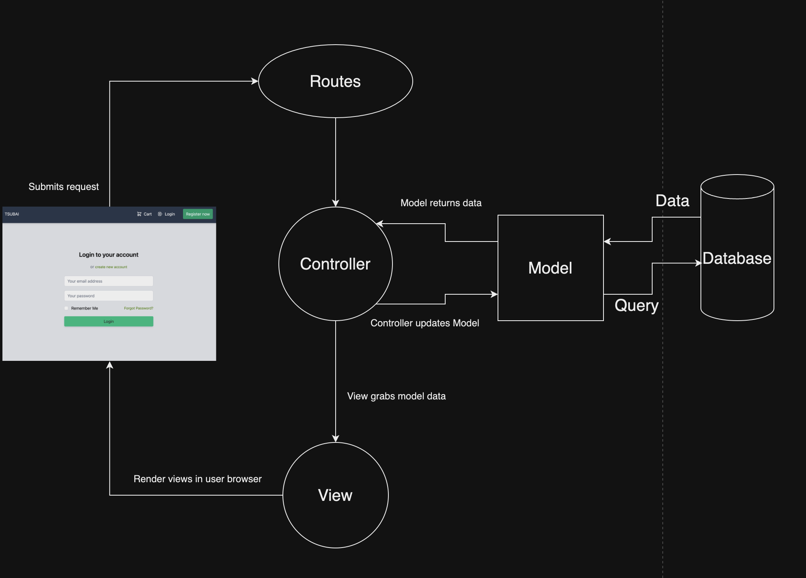
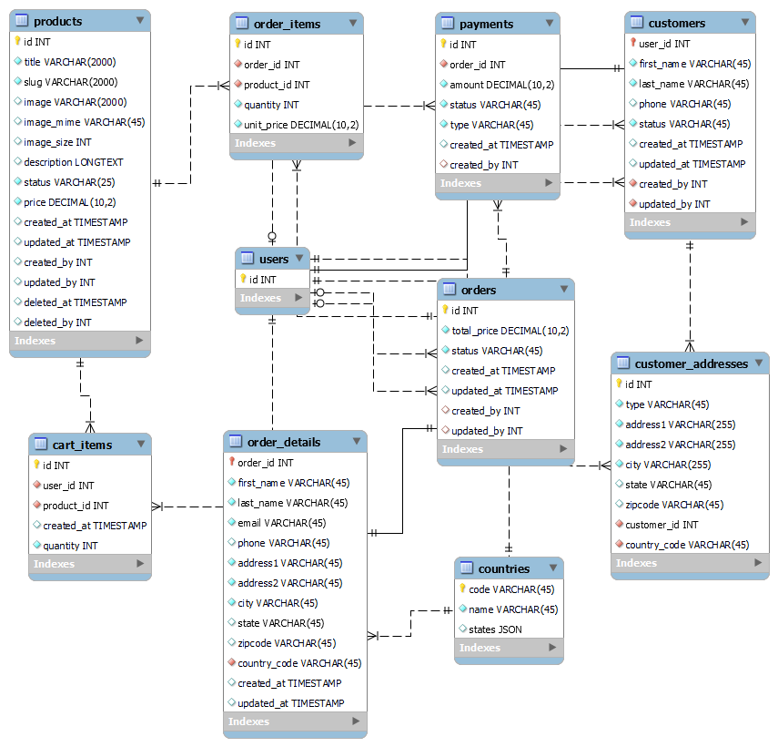
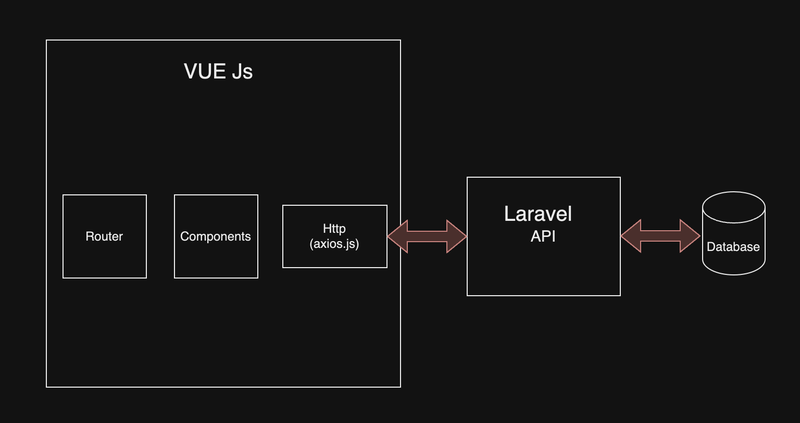

# Tsubai 
E-commerce application built with Laravel, Vue.js, Tailwind.css and Alpine.js. <br>

## Installation 
Make sure you have environment setup properly. 
You will need MySQL, PHP, Node.js , composer.
Docker and laravel sail if you want to deploy it in docker.

### Install Laravel Website + API
1. Download the project (or clone using GIT)
2. Copy `.env.example` into `.env` and configure database credentials
3. Navigate to the project's root directory using terminal
4. Run `composer install`
5. Set the encryption key by executing `php artisan key:generate --ansi`
6. composer require laravel/sail --dev
7. Install php artisan sail:install
8. Start local server by executing `./vendor/bin/sail up`
9. Run migrations `./vendor/bin/sail artisan migrate --seed`
10. Open new terminal and navigate to the project root directory
11. Run `npm install`
12. Run `npm run dev` to start vite server for Laravel frontend

### Install Vue.js Admin Panel
1. Navigate to `backend` folder
2. Run `npm install`
3. Copy `backend/.env.example` into `backend/.env`
4. Make sure `VITE_API_BASE_URL` key in `backend/.env` is set to your Laravel API host (Default: http://localhost:18002)
5. Run `npm run dev`
6. Open Vue.js Admin Panel in browser and login with
    ```
    admin@example.com
    admin123
    ```

# Tsubai 
Laravel、Vue.js、Tailwind.css、Alpine.jsを使用して構築されたEコマースアプリケーションです。<br>

## インストール 
環境が適切にセットアップされていることを確認してください。 
MySQL、PHP、Node.js、Composerが必要です。
Dockerを使用してデプロイする場合は、laravel sailも必要です。

### Laravelウェブサイト+APIをインストールする
1. プロジェクトをダウンロードします（またはGITを使用してクローンします）
2. `.env.example`を`.env`にコピーし、データベースの資格情報を設定します
3. ターミナルを使用してプロジェクトのルートディレクトリに移動します
4. `composer install`を実行します
5. 暗号化キーを設定します： `php artisan key:generate --ansi`を実行します
6. `composer require laravel/sail --dev`を実行します
7. `php artisan sail:install`を実行します
8. `./vendor/bin/sail up`を実行してローカルサーバーを起動します
9. マイグレーションを実行します： `./vendor/bin/sail artisan migrate --seed`を実行します
10. 新しいターミナルを開き、プロジェクトのルートディレクトリに移動します
11. `npm install`を実行します
12. Laravelフロントエンドのviteサーバーを起動するには、`npm run dev`を実行します

### Vue.js管理パネルをインストールする
1. `backend`フォルダに移動します
2. `npm install`を実行します
3. `backend/.env.example`を`backend/.env`にコピーします
4. `backend/.env`の`VITE_API_BASE_URL`キーがLaravel APIホストに設定されていることを確認します（デフォルト：http://localhost:18002）
5. `npm run dev`を実行します
6. ブラウザでVue.js管理パネルを開き、次の情報でログインします
    ```
    admin@example.com
    admin123
    ```

Laravel Architecture
Laravelアーキテクチャ



Database scheme
データベーススキーマ



Admin Panel Architecture

